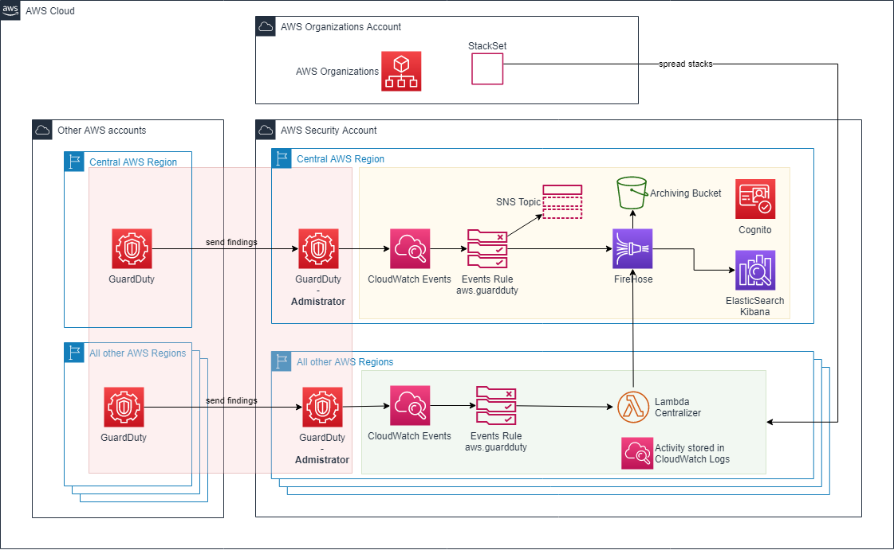

# GuardDuty Centralizer

## Introduction

[Amazon GuardDuty](https://aws.amazon.com/guardduty) is a great service which looks for threats and suspicious activity on network flows (VPC and DNS) and CloudTrail messages. Once activated, the service gathers all findings of one account in the same region.
For large organizations, it is possible to define a central "GuardDuty Administrator" account to centralize findings.
Unfortunately, findings are still simply retrieved on a per-region basis...
That is where GuardDuty Centralizer comes from ...

## Description

GuardDuty Centralizer works as an extension of [Visualizing Amazon GuardDuty findings](https://aws.amazon.com/fr/blogs/security/visualizing-amazon-guardduty-findings/) and forwards all GuardDuty findings of the used AWS regions into a the central visualization system (ElasticSearch + Kibana)

## Design

### Diagram

- red zone is the concern of [guarduduty-recruiter](https://github.com/jcaffet/guardduty-recruiter)
- yellow zone is implemented in [Visualizing Amazon GuardDuty findings](https://aws.amazon.com/fr/blogs/security/visualizing-amazon-guardduty-findings/)
- green zone is the concern of this repository.

### Content

- CloudWatch Rule to trigger the Lambda executions
- one Lambda to put date to Firehose
- CloudWatch Logs to log the global activity
- one shared role to allow the Lambda to put data into Firehose.

### Explanation

GuardDuty Centralizer simply filters in a rule all CloudWatch Events in each regions of the security account (except the central region), and triggers a Lambda to put data into the existing central Kinesis Firehose. Then, data are performed as the ones already handled in the central region.

## Prerequisites

GuardDuty Centralizer needs :
- a pre-activation of GuardDuty in all the interesting regions, with a centralization of the GuardDuty findings into the central GuardDuty Administrator account, on a per-region basis. Look at [amazon-guardduty-multiaccount-scripts](https://github.com/aws-samples/amazon-guardduty-multiaccount-scripts), or [guarduduty-recruiter](https://github.com/jcaffet/guardduty-recruiter) for an industrial implementation.
- an existing installation of [Visualizing Amazon GuardDuty findings](https://aws.amazon.com/fr/blogs/security/visualizing-amazon-guardduty-findings/) in a central region.

## Installation

1. deploy the [cf-guarddutycentralizer-central.yml](cf-guarddutycentralizer-central.yml) CloudFormation stack in the central region of the security account
2. deploy the [cf-guarddutycentralizer-spoke.yml](cf-guarddutycentralizer-spoke.yml) in each useful regions, *except the central one*, in the security account. Do not hesitate to use a CloudFormation StackSet.

## How to use it

Once installed, nothing has to be done. All findings are pushed in Firehose and can be found through Kibana or the archive S3 bucket.

## Notes
- it is also possible to configure between the CloudWatch Rule and the lambda an intermediate SNS topic. Interesting if you need specific action or invocation per region (see [alternative](alternative/) directory)
- new regions are not added automatically. Maybe in v2 ...
